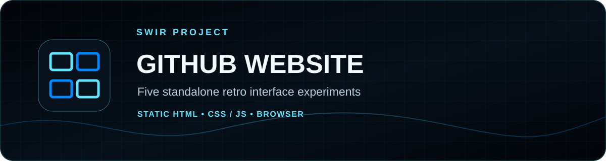
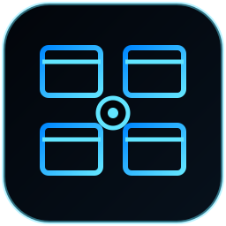
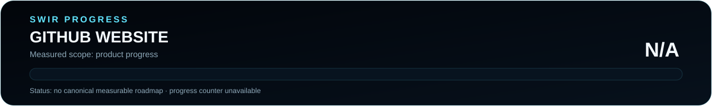

<!-- SWIR-README-STANDARD:v2 -->

<div align="center">



<br>



<br>


[](https://github.com/Swir)

[**Themes**](#-available-themes) · [**Quick Start**](#%EF%B8%8F-quick-start) · [**Progress**](#%EF%B8%8F-progress) · [**Limitations**](#%EF%B8%8F-limitations)

</div>


## 📍 Project Status



| Item | Status |
|---|---|
| Current stage | Maintained retro UI collection |
| Delivery | Five standalone HTML files |
| Build step | Not required |
| Latest public release | Not published as a GitHub Release |
| Product progress | **N/A** — no canonical measurable product roadmap |

The SVG reports **product progress**, not documentation completion. A version number, file count, commit count or README migration is not treated as a product-completion percentage.

## 🚀 Overview

**GitHub Website — Retro UI Collection** is a set of five independent browser experiments inspired by classic computer and operating-system interface styles. Each page keeps its HTML, CSS and JavaScript together so it can be opened directly in a modern browser without a package manager or build pipeline.

The current repository contains Atari ST/GEM-inspired, classic Macintosh-inspired, Commodore 64-inspired, Windows 3.11-inspired and Windows 95-inspired interfaces.

## 🖥️ Available Themes

| File | Theme |
|---|---|
| `Atari.html` | Atari ST / GEM-inspired interface |
| `Macintosh.html` | Classic Macintosh-inspired interface |
| `comodore64.html` | Commodore 64-inspired interface |
| `windows3.11.html` | Windows 3.11-inspired interface |
| `windows95.html` | Windows 95-inspired GitHub Explorer interface |

## ✨ Highlights

| Feature | What it provides |
|---|---|
| ⚡ No build pipeline | Open a page directly in a browser |
| 🧩 Self-contained page logic | Each theme is maintained as its own HTML file |
| 🖱️ Interactive UI experiments | Embedded JavaScript drives theme-specific interactions |
| 🕹️ Five visual directions | Explore different classic-computing interface languages |
| 🌐 Easy local serving | Any simple static HTTP server can host the collection |

## ⚙️ Quick Start

### Direct

Clone the repository and open any HTML file in a modern browser:

```bash
git clone https://github.com/Swir/Github_Webste.git
cd Github_Webste
```

Then open one of:

```text
Atari.html
Macintosh.html
comodore64.html
windows3.11.html
windows95.html
```

### Optional local server

If you have Python installed:

```bash
python -m http.server 8000
```

Then visit `http://localhost:8000/` and choose a page.

## 📋 Requirements / Compatibility

- A modern desktop browser with JavaScript enabled.
- No Node.js, bundler or package installation is required.
- Several pages reference Font Awesome from a public CDN, so those icon assets require network access unless you adapt the pages for offline use.
- Browser rendering can differ slightly across engines and operating systems.

## 🎮 Usage / Workflow

These pages are frontend experiments rather than an application with a shared launcher. Edit the HTML file for the theme you want to customize, then refresh it in the browser.

The platform names describe the visual inspiration. The repository does not contain or distribute original operating-system binaries.

## 🧠 Technology / Architecture

| Layer | Technology / role |
|---|---|
| Markup | HTML5 |
| Styling | Embedded CSS |
| Interaction | Embedded JavaScript |
| Optional icons | Font Awesome loaded from CDN by the theme pages |
| Build / packaging | None required |

## 🗺️ Progress


No canonical milestone roadmap is currently published in this repository, so product completion is intentionally reported as **N/A**. The SVGs are generated deterministically by `tools/readme_progress.py`.

Check that the committed graphics and README stay synchronized:

```bash
python tools/readme_progress.py --check
```

## 📦 Releases

There is currently **no public GitHub Release** for this repository. Use the files from the repository directly.

## ⚠️ Limitations

- This is an independent visual/UI experiment, not an emulator or operating-system distribution.
- Platform names and trademarks belong to their respective owners.
- Visual fidelity and interaction depth differ between themes.
- CDN-hosted icon assets can be unavailable when offline.

## 🔎 Search Keywords

`retro html ui` • `windows 95 web interface` • `windows 3.11 css` • `commodore 64 html` • `atari gem web ui` • `classic macintosh interface` • `retro javascript ui` • `vintage computer website` • `standalone html interface` • `retro frontend experiments`


<div align="center">

### `RETRO • BUILD • EXPERIMENT • EVOLVE`

⭐ **If you enjoy these retro interface experiments, consider leaving a star.**

[**← SWIR profile**](https://github.com/Swir) · [**All projects →**](https://github.com/Swir?tab=repositories)

</div>
